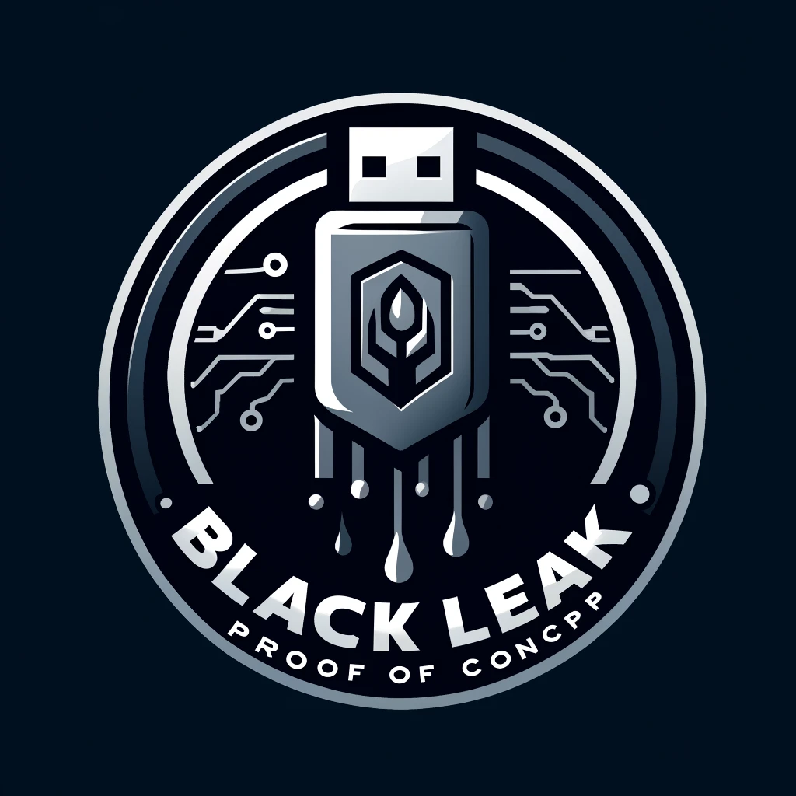

[![CVSS3][cvss3-shield]][cvss4-url]
[![CVSS4 License][cvss4-shield]][cvss3-url]
[![MIT License][license-shield]][license-url]
[![LinkedIn][linkedin-shield]][linkedin-url]


<!-- PROJECT LOGO -->
<br />
<div align="center">
  <a href="https://fe.hr">
    
  </a>

  <h3 align="center">BlackLeak</h3>

  <p align="center">
    Proof of Concept for CVE-2024-30212
  </p>
</div>


<!-- TABLE OF CONTENTS -->
<details>
  <summary>Table of Contents</summary>
  <ol>
    <li>
      <a href="#about-the-project">About The PoC</a>
    </li>
    <li>
      <a href="#getting-started">Getting Started</a>
      <ul>
        <li><a href="#prerequisites">Prerequisites</a></li>
        <li><a href="#installation">Installation</a></li>
      </ul>
    </li>
    <li><a href="#usage">Usage</a></li>
    <li><a href="#license">License</a></li>
    <li><a href="#contact">Contact</a></li>
    <li><a href="#acknowledgments">Acknowledgments</a></li>
  </ol>
</details>


<!-- ABOUT THE POC -->
## About The PoC

This is the proof of concept for CVE-2024-30212.

For more details check https://cve.mitre.org/cgi-bin/cvename.cgi?name=CVE-2024-30212

<p align="right">(<a href="#readme-top">back to top</a>)</p>


<!-- GETTING STARTED -->
## Getting Started

### Prerequisites

* libusb
  ```
  apt install libusb-1.0-0-dev
  ```

### Installation

1. Clone the repo
   ```
   git clone https://github.com/Fehr-GmbH/blackleak.git
   ```
2. Switch dir
   ```
   cd blackleak
   ```
3. Change TARGET_VID and TARGET_PID according to your target device in main.c
   ```
   nano ./main.c
   ```
4. Make
   ```
   make
   ```

<p align="right">(<a href="#readme-top">back to top</a>)</p>


<!-- USAGE EXAMPLES -->
## Usage

1. ./blackleak -r
2. Connect USB target device
3. Profit

<p align="right">(<a href="#readme-top">back to top</a>)</p>


<!-- LICENSE -->
## License

Distributed under the MIT License. See `LICENSE` for more information.

<p align="right">(<a href="#readme-top">back to top</a>)</p>


<!-- CONTACT -->
## Contact

Dominik Fehr - d[at]fe[dot]hr

Project Link: [https://github.com/Fehr-GmbH/blackleak](https://github.com/Fehr-GmbH/blackleak)

<p align="right">(<a href="#readme-top">back to top</a>)</p>


<!-- ACKNOWLEDGMENTS -->
## Acknowledgments

* [Beyond Logic](https://www.beyondlogic.org/usbnutshell/usb1.shtml)
* solderless
* [Hiroka Ihara](https://github.com/ihr486/libusb-msdbot)
* [Best-README-Template](https://github.com/othneildrew/Best-README-Template/tree/master)
* [Img Shields](https://shields.io/)
* Logo image was created with the assistance of DALL·E 2

<p align="right">(<a href="#readme-top">back to top</a>)</p>


<!-- MARKDOWN LINKS & IMAGES -->
<!-- https://www.markdownguide.org/basic-syntax/#reference-style-links -->
[cvss3-shield]: https://img.shields.io/badge/CVSS_v3.1-7.6_/_High-red?style=for-the-badge
[cvss3-url]: https://www.first.org/cvss/calculator/3.1#CVSS:3.1/AV:P/AC:L/PR:N/UI:N/S:C/C:H/I:H/A:H
[cvss4-shield]: https://img.shields.io/badge/CVSS_v4.0-7.0_/_High-red?style=for-the-badge
[cvss4-url]: https://www.first.org/cvss/calculator/4.0#CVSS:4.0/AV:P/AC:L/AT:N/PR:N/UI:N/VC:H/VI:H/VA:H/SC:N/SI:N/SA:N
[license-shield]: https://img.shields.io/badge/license-MIT-blue?style=for-the-badge
[license-url]: https://github.com/Fehr-GmbH/blackleak/COPYING
[linkedin-shield]: https://img.shields.io/badge/-LinkedIn-black.svg?style=for-the-badge&logo=linkedin&colorB=555
[linkedin-url]: https://de.linkedin.com/company/fehr2
